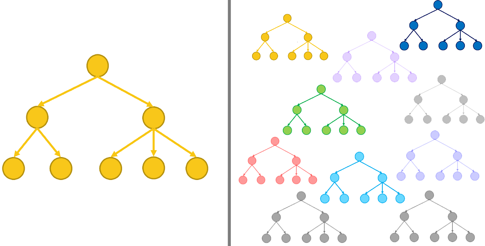
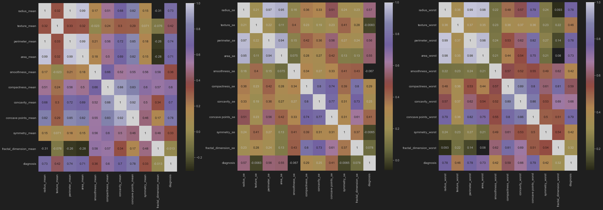
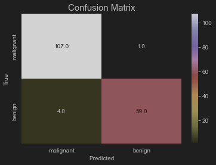

# SBE2240 - Biostatistics Final Project
## NIMA Web app For Breast Cancer Detection
Machine learning supervised model that predicts the occurrence of breast cancer deployed on a web app for everyone

### Table of Contents
- [Introduction](#introduction)
- [Machine Learning](#machine-learning-process)
  - [Classifier](#1---random-forest-classifier-decision-tree-based)
  - [Dataset](#2--dataset)
  - [Results](#3--results)
- [Backend](#backend-server)

### Introduction
Breast cancer is cancer that develops from breast tissue. Signs of breast cancer may include a lump in the breast, 
a change in breast shape, dimpling of the skin, fluid coming from the nipple, a newly inverted nipple, or a red or scaly
patch of skin. In those with distant spread of the disease, there may be bone pain, swollen lymph nodes, shortness of 
breath, or yellow skin.

### Languages & Frameworks
1. Python (Machine Learning)
2. HTML, CSS, JavaScript (Frontend)
3. Flask (Backend)

to start the server run 
### `python app.py` 

### Machine Learning Process
- Classifier
- Dataset Exploration
- Results

####  1 - Random Forest Classifier (Decision Tree Based)
A classifier that contains a number of decision trees on various subsets of the given dataset and takes the average 
to improve the predictive accuracy of that dataset.

  - #### Decision Tree 
    A decision tree is a flowchart-like structure in which each internal node represents a "test" on an attribute (e.g. 
  whether a coin flip comes up heads or tails), each branch represents the outcome of the test, and each leaf node represents
  a class label (decision taken after computing all attributes).

  

  Creating a bootstrapped dataset (having same size as the original) where samples are randomly selected from original dataset. 
  Creating a decision tree with the bootstrapped dataset with the use of one random feature in each step.
  Process is repeated resulting in a wide variety of trees (effectively better than a decision tree).

  #### 2- Dataset

We used [Breast Cancer Wisconsin (Diagnostic) Data Set](https://www.kaggle.com/datasets/uciml/breast-cancer-wisconsin-data)
that has 32 feature and 569 record of malignant and begin breast cancer record with the ratio of 2:3 respectively.

Ten real-valued features are computed for each cell nucleus. The mean, standard error and "worst" or largest of these 
features were computed for each image, resulting in total of 30 features. 

1.  Radius (mean of distances from center to points on the perimeter)
1.  Texture (standard deviation of gray-scale values)
1.  Perimeter
1.  Area
1.  Smoothness (local variation in radius lengths)
1.  Compactness (perimeter^2 / area - 1.0)
1.  Concavity (severity of concave portions of the contour)
1.  Concave points (number of concave portions of the contour)
1.  Symmetry
1.  Fractal dimension (coastline approximation  - 1)

In our project we used only 10 of them which was:

1. texture mean        
2. area mean
3. smoothness mean
4. concavity mean
5. area se
6. concavity se
7. fractal dimension se
8. smoothness worst
9. concavity worst
10. symmetry worst

Then a correlation function is used to find the relation between each feature and the diagnosis. ( if +ve therefore 
directly proportional, -ve therefore inversely proportional)

The effective features that affect the diagnosis are then considered. having corr=>60% for mean,
corr=>60% for SE, corr=>70% for worst.

#### 3- Results
The Model Showed Precision of 96.8% & Accuracy of 97.1%

### Backend Server

Our Sever consists of 3 routes, 
1. Main Page Route
2. Test Page Route
3. Prediction API Route

After the model is saved into a pikle file `model.pkl`,  this file is loaded in the `app.py` file to
be ready for prediction. User enter the 10 features and this data is passed to the model to predict
and the give the answer back to be shown in a modal.

### Deployment

To Deploy your app using heroku, you will need `Procfile`, `requirments.txt` and a web server (eg. gunicorn)

1. Create your account in heroku
2. Set up your files locally
3. Sign in to your heroku account

    $ heroku login

4. Create your heroku app

    $ heroku create nima-sbme24

5- Add heroku remote to your app

    $ git remote -v
    heroku  https://git.heroku.com/example-app.git (fetch)
    heroku  https://git.heroku.com/example-app.git (push)

6- Deploy your app

    $ git push heroku master

### NIMA Stands for 'N'ouran, 'I'brahim, 'M'ohamed, 'A'hmed
## Visit us at [nima-sbme24.herokuapp.com/](https://nima-sbme24.herokuapp.com/)